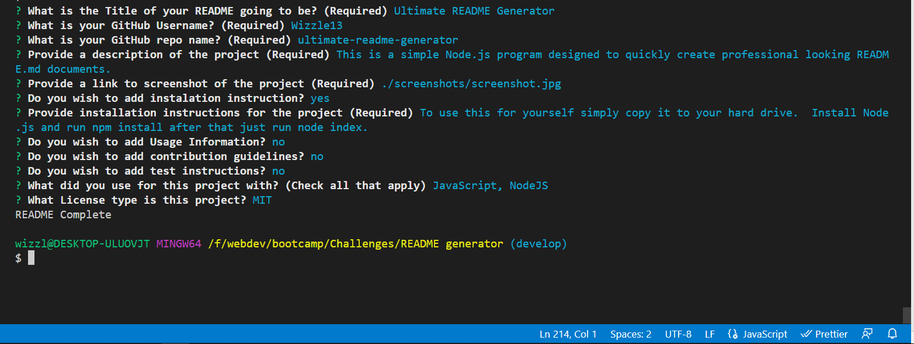

  # Ultimate README Generator
  
  
  
  
  
  ## Description
  This is a simple Node.js program designed to quickly create professional looking README.md documents.

  ### Tools and Languages used
  
  
  
  
  ## Table of Contents
  - [Installation](#installation)
  
  - [Screenshots](#screenshots)
  
  - [Contributions](#contributions)
  - [Links](#links)
  
  ## Installation
To use this for yourself simply copy it to your hard drive.  Install Node.js and run npm install after that just run node index.
    

  

  ## Screenshots
  

  

  ## Links
  GitHub Repository: https://github.com/Wizzle13/ultimate-readme-generator

  Walkthrough Video: https://wizzle13.github.io/ultimate-readme-generator/

  &copy;2020 by Chris Burton
